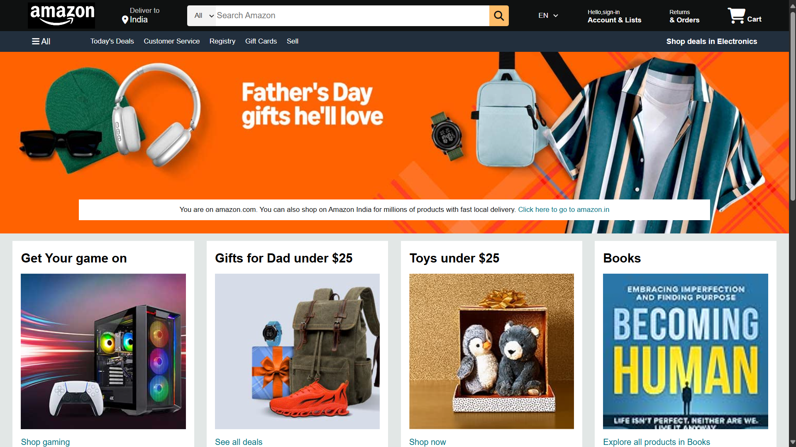
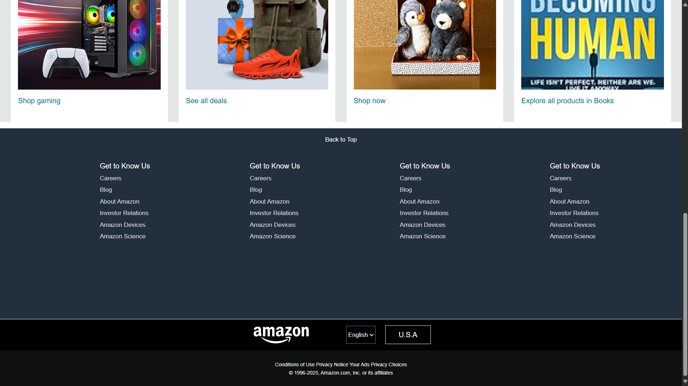

# Amazon CSS HTML Clone

This project is a simple clone of the Amazon homepage using only HTML and CSS. It is intended for educational purposes and to practice front-end web development skills.

## Features
- Responsive navigation bar
- Product showcase section
- Footer with multiple panels
- Use of Font Awesome icons
- Custom background images and styles

## Getting Started
1. Clone the repository:
   ```
   git clone https://github.com/xthunder91/Amazon-CSS-HTML-clone.git
   ```
2. Open the project folder.
3. Open `index.html` in your browser to view the site.

## Screenshots



## License
This project is for educational purposes only and is not affiliated with Amazon.
